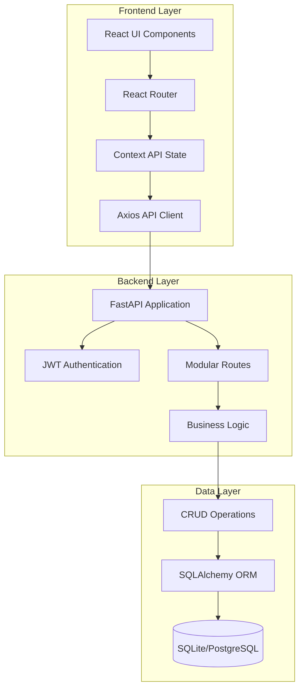
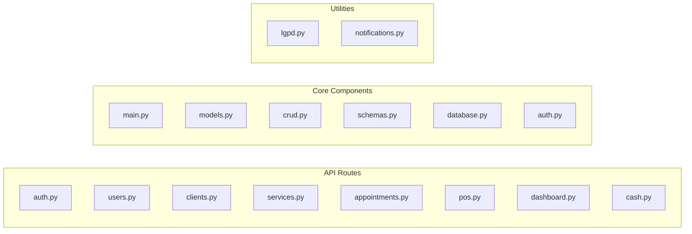
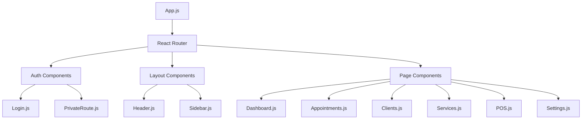
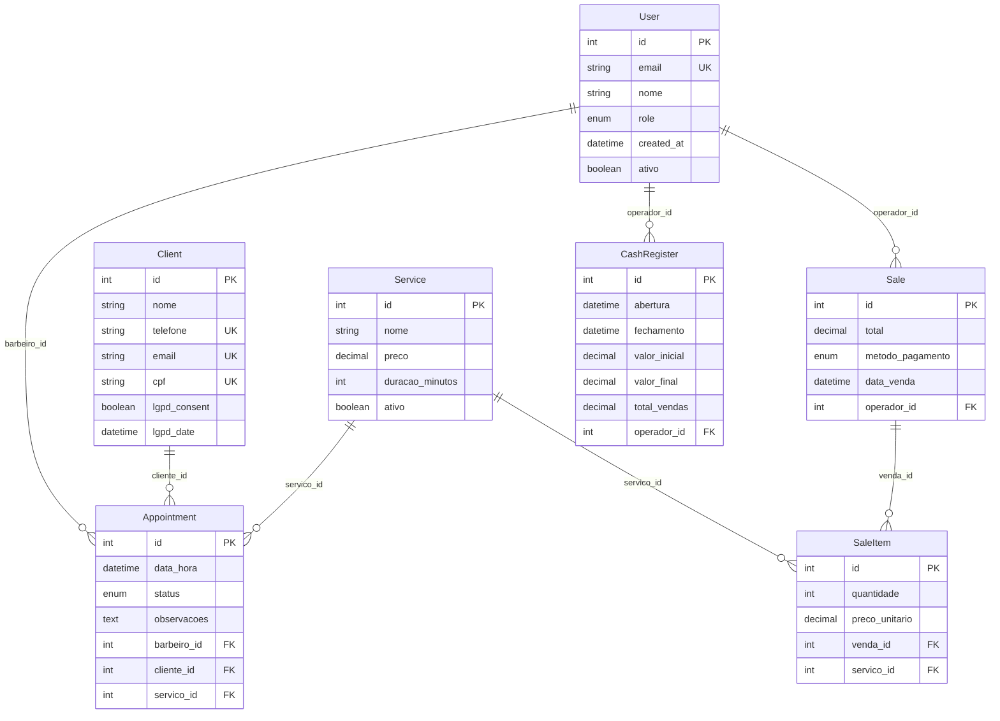
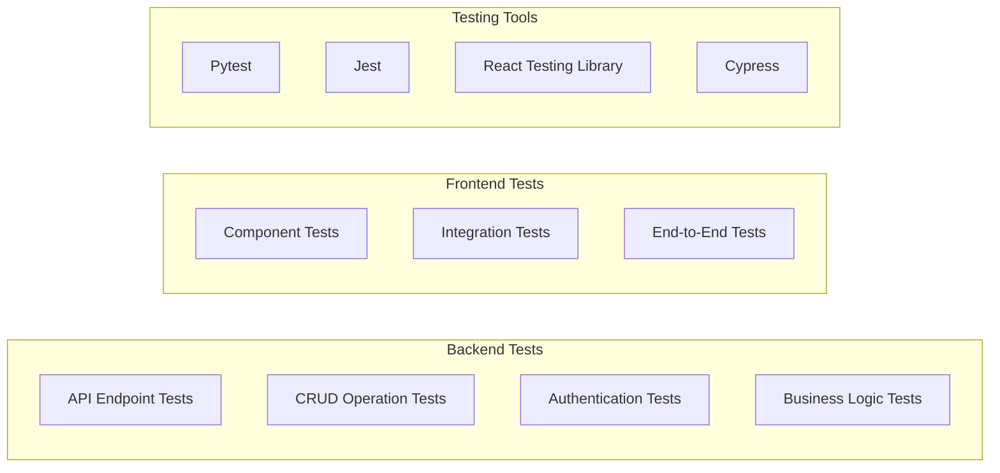
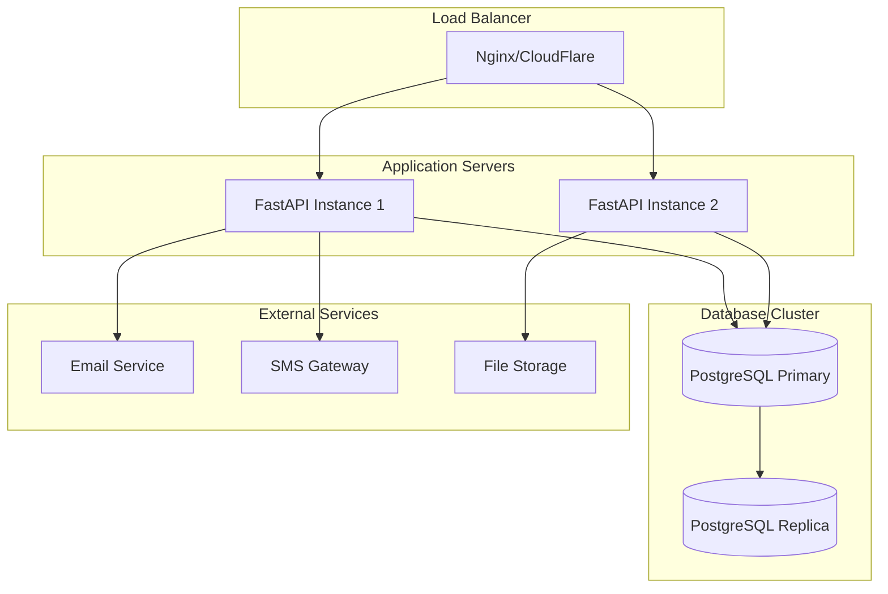
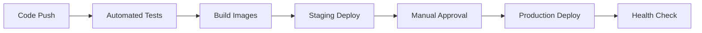

# BarberManager Project Development Tracking

## 1. Overview

The **BarberManager** is a comprehensive barbershop management system designed to streamline operations through digital transformation. Built with a modern full-stack architecture using FastAPI (Python backend) and React (frontend), the system provides multi-user role-based access for managing appointments, clients, services, and point-of-sale operations.

### Core Value Proposition
- **Digital Transformation**: Convert manual barbershop operations to automated digital workflows
- **Multi-User System**: Role-based access control for Admin, Barbeiro (Barber), and Recepcionista (Receptionist)
- **Complete Management**: End-to-end solution from appointment booking to payment processing
- **LGPD Compliance**: Built-in features for Brazilian data protection regulations

## 2. Architecture

### System Architecture Pattern
The application follows a **three-tier layered architecture** with modular organization:

### Technology Stack

#### Backend Stack
- **Framework**: FastAPI with async/await support
- **Database**: SQLAlchemy ORM (SQLite development, PostgreSQL production)
- **Authentication**: JWT tokens with bcrypt password hashing
- **Validation**: Pydantic schemas for request/response validation
- **Server**: Uvicorn ASGI server

#### Frontend Stack
- **Framework**: React with functional components and hooks
- **Routing**: React Router for client-side navigation
- **State Management**: Context API (AuthContext, ThemeContext)
- **Styling**: Bootstrap 5 with custom CSS variables
- **HTTP Client**: Axios with request/response interceptors

### Component Architecture

#### Backend Module Organization

#### Frontend Component Hierarchy

## 3. API Endpoints Reference

### Authentication & Authorization System

#### JWT-Based Authentication
- **POST** `/auth/login` - User login with email/password
- **POST** `/auth/register` - New user registration (admin only)
- **GET** `/auth/me` - Get current user profile
- **PUT** `/auth/profile` - Update user profile

#### Role-Based Access Control
| Role | Permissions |
|------|-------------|
| **Admin** | Full system access, user management, service configuration |
| **Barbeiro** | Own appointments, client interactions, personal dashboard |
| **Recepcionista** | Client management, appointment scheduling, POS operations |

### Core Business APIs

#### Appointments Management
- **GET** `/appointments` - List appointments with filters (date, barbeiro)
- **POST** `/appointments` - Create new appointment
- **PUT** `/appointments/{id}` - Update appointment details
- **DELETE** `/appointments/{id}` - Cancel appointment
- **GET** `/appointments/calendar` - Calendar view data

#### Client Management
- **GET** `/clients` - List all clients with search/pagination
- **POST** `/clients` - Create new client profile
- **PUT** `/clients/{id}` - Update client information
- **DELETE** `/clients/{id}` - Soft delete client (LGPD compliant)
- **GET** `/clients/{id}/history` - Client service history

#### Services Catalog
- **GET** `/services` - List available services
- **POST** `/services` - Create new service (admin only)
- **PUT** `/services/{id}` - Update service pricing/duration
- **DELETE** `/services/{id}` - Deactivate service

#### Point of Sale System
- **POST** `/pos/sales` - Process new sale transaction
- **GET** `/pos/sales` - List sales with date filtering
- **GET** `/pos/payment-methods` - Available payment options

#### Dashboard Analytics
- **GET** `/dashboard/stats` - Real-time business statistics
- **GET** `/dashboard/recent-activities` - Recent system activities
- **GET** `/dashboard/upcoming-appointments` - Next appointments

## 4. Data Models & ORM Mapping

### Core Entity Relationships

### Business Logic Specifications

#### Appointment Conflict Prevention
- **Time Overlap Detection**: Validates appointment start/end times against existing bookings
- **Service Duration Calculation**: Automatic duration based on service configuration
- **Barbeiro Availability**: Prevents double-booking for the same barbeiro

#### LGPD Compliance Features
- **Consent Tracking**: Records LGPD consent date and status
- **Data Export**: Client data export functionality for compliance requests
- **Data Anonymization**: Tools for anonymizing client data when required
- **Right to be Forgotten**: Soft delete with data anonymization

## 5. Testing Strategy

### Unit Testing Approach

#### Backend Testing Framework
- **Pytest**: Main testing framework for Python backend
- **FastAPI TestClient**: API endpoint testing
- **Database Fixtures**: Isolated test database instances
- **Mock External Services**: Email/SMS notification mocking

#### Frontend Testing Framework
- **Jest**: JavaScript testing framework
- **React Testing Library**: Component testing utilities
- **Cypress**: End-to-end user journey testing
- **Mock Service Worker**: API mocking for frontend tests

### Testing Coverage Goals
| Component | Target Coverage | Current Status |
|-----------|----------------|----------------|
| Backend APIs | 90% | 🔴 Not Started |
| CRUD Operations | 95% | 🔴 Not Started |
| Authentication | 100% | 🔴 Not Started |
| Frontend Components | 80% | 🔴 Not Started |
| User Workflows | 85% | 🔴 Not Started |

## 6. Current Development Status

### Project Completion: **85%**

#### ✅ Completed Features (70%)
- **Core Architecture**: FastAPI backend + React frontend structure
- **Authentication System**: JWT-based multi-role authentication
- **Database Models**: Complete ORM models with relationships
- **API Endpoints**: Full REST API implementation
- **User Interface**: Complete React frontend with responsive design
- **Appointment Management**: Full CRUD with conflict detection
- **Client Management**: Complete client lifecycle with LGPD compliance
- **Services Catalog**: Service management with pricing configuration
- **Point of Sale**: Functional POS system with multiple payment methods
- **Dashboard Analytics**: Real-time business statistics and metrics
- **Cash Management**: Complete cash register operations

#### 🔄 In Development (15%)
- **Automated Notifications**: Email/SMS reminder system (35% complete)
- **Public Online Booking**: Customer-facing appointment booking (pending)
- **Advanced Reporting**: Enhanced analytics and export features (60% complete)

#### ❌ Not Started (15%)
- **Loyalty Program**: Points system and customer rewards
- **Inventory Management**: Product stock control
- **External Integrations**: WhatsApp API, payment gateways
- **Mobile Application**: React Native app for barbers

### Critical Issues Resolution Status

#### ✅ Recently Resolved
1. **Appointment Conflict Detection**: Implemented automatic time overlap prevention
2. **Real Dashboard Data**: Connected dashboard statistics to actual database data
3. **Cash Management System**: Complete cash register open/close operations
4. **Service-Based Duration**: Automatic appointment duration calculation

#### 🟡 Medium Priority Issues
- **Query Performance**: Database optimization needed for large datasets
- **Form Validations**: Enhanced client-side validation requirements
- **Responsive Design**: Mobile optimization for some components

## 7. Development Roadmap

### Phase 1: MVP Completion (Current - Next 2 weeks)
**Objective**: Production-ready system for basic barbershop operations

#### Sprint 1.1: Notification System Implementation
- **Email Integration**: SMTP configuration for appointment reminders
- **Template System**: Customizable email templates
- **Automated Scheduling**: 24-hour advance reminder system
- **Manual Notifications**: Admin-triggered customer communications

#### Sprint 1.2: Public Booking Interface
- **Customer Portal**: Public-facing appointment booking page
- **Available Slots**: Real-time availability calculation
- **Service Selection**: Customer service and barbeiro choice
- **Booking Confirmation**: Email confirmation system

### Phase 2: Enhanced Features (Weeks 3-6)
**Objective**: Competitive differentiation and operational efficiency

#### Sprint 2.1: Loyalty & Promotions System
- **Points Accumulation**: Service-based point earning system
- **Reward Redemption**: Point-to-discount conversion
- **Promotional Campaigns**: Targeted customer promotions
- **Membership Tiers**: VIP customer classification

#### Sprint 2.2: Inventory Management
- **Product Catalog**: CRUD operations for salon products
- **Stock Control**: Inventory tracking and low-stock alerts
- **Sales Integration**: Product sales through POS system
- **Supplier Management**: Vendor and purchase order tracking

#### Sprint 2.3: Advanced Analytics
- **Performance Dashboards**: Barbeiro performance metrics
- **Customer Analytics**: Retention and frequency analysis
- **Revenue Reporting**: Advanced financial reporting
- **Predictive Analytics**: Demand forecasting using historical data

### Phase 3: Innovation & Scaling (Weeks 7-12)
**Objective**: Market differentiation and advanced automation

#### Sprint 3.1: Mobile Application
- **React Native App**: Barbeiro mobile application
- **Offline Capability**: Local data synchronization
- **Push Notifications**: Real-time appointment updates
- **Calendar Integration**: Native device calendar sync

#### Sprint 3.2: External Integrations
- **WhatsApp Business API**: Automated customer communication
- **Payment Gateways**: Credit card processing integration
- **Google Calendar Sync**: Two-way calendar synchronization
- **Social Media**: Instagram/Facebook booking integration

#### Sprint 3.3: AI & Automation
- **Intelligent Scheduling**: AI-powered appointment optimization
- **Customer Recommendations**: Personalized service suggestions
- **Chatbot Integration**: Automated customer service
- **Predictive Maintenance**: System health monitoring

## 8. Deployment Architecture

### Production Environment Setup

### Infrastructure Requirements

#### Minimum Production Specifications
- **Server**: 2 CPU cores, 4GB RAM, 50GB SSD
- **Database**: PostgreSQL 14+ with automated backups
- **Web Server**: Nginx reverse proxy with SSL termination
- **SSL Certificate**: Let's Encrypt or commercial certificate
- **Monitoring**: Basic uptime and performance monitoring

#### Recommended Production Setup
- **Application Server**: 4 CPU cores, 8GB RAM, 100GB SSD
- **Database Server**: Dedicated PostgreSQL instance with replication
- **CDN**: CloudFlare for static asset delivery
- **Backup Strategy**: Daily automated backups with 30-day retention
- **Monitoring**: Comprehensive APM with alerting

### Deployment Pipeline

#### Continuous Integration/Deployment

#### Deployment Steps
1. **Automated Testing**: Run backend and frontend test suites
2. **Docker Build**: Create production-ready container images
3. **Staging Deployment**: Deploy to staging environment for validation
4. **Database Migration**: Apply database schema changes
5. **Production Deployment**: Blue-green deployment with rollback capability
6. **Health Monitoring**: Post-deployment system health verification

### Security Considerations

#### Application Security
- **Authentication**: JWT tokens with secure key rotation
- **Authorization**: Role-based access control with least privilege
- **Data Encryption**: TLS 1.3 for data in transit, AES-256 for data at rest
- **Input Validation**: Comprehensive request validation and sanitization
- **SQL Injection Prevention**: Parameterized queries through ORM

#### Infrastructure Security
- **Network Security**: VPC with private subnets for database
- **Access Control**: SSH key authentication and VPN access
- **Monitoring**: Security event logging and anomaly detection
- **Backup Security**: Encrypted backups with access controls
- **Compliance**: LGPD compliance with data protection measures

This development tracking document provides a comprehensive view of the BarberManager project's current state, architecture, and future development plans. The system demonstrates significant maturity with 85% completion and a solid foundation for barbershop management operations.